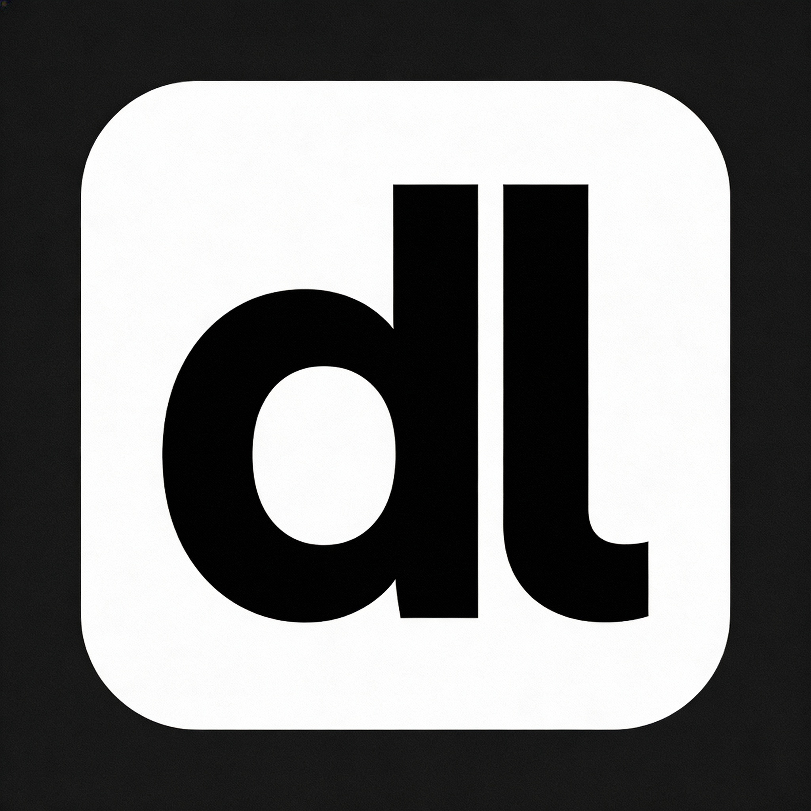

<div align="center">



# devlog

_생각에 집중할 수 있는, 개발자를 위한 세련된 블로그 서비스_

[](https://nextjs.org/)
[](https://www.typescriptlang.org/)
[](https://tailwindcss.com/)
[](https://tanstack.com/query/latest)


<!--
아래 주석을 해제하고 스크린샷을 추가하세요


-->

</div>

---

## ✨ Key Features

devLog는 글쓰기에 방해받지 않는 경험을 제공합니다.

🎨 **생각을 방해하지 않는 미니멀한 에디터**  
Notion처럼 직관적인 블록 기반 에디터로, `/` 명령어만으로 모든 컨텐츠 블록을 생성할 수 있습니다.

🌓 **눈의 피로를 줄이는 부드러운 테마 전환**  
다크/라이트 모드가 깜빡임 없이 부드럽게 전환되며, 시스템 설정을 자동으로 감지합니다.

📱 **어떤 화면에서도 완벽한 반응형 디자인**  
모바일부터 데스크톱까지, 여백과 타이포그래피를 강조한 읽기 좋은 레이아웃을 제공합니다.

🎭 **자연스러운 인터랙션 애니메이션**  
페이지 전환과 컴포넌트 상호작용에서 섬세한 애니메이션이 사용자 경험을 향상시킵니다.

---

## 🛠️ Tech Stack

<div align="center">

| Category  | Technologies                             |
| :-------: | :--------------------------------------- |
| Framework | Next.js 16 (App Router), React 19        |
| Language  | TypeScript                               |
|  Styling  | Tailwind CSS v4                          |
|    UI     | shadcn/ui, React Icons                   |
|  Editor   | BlockNote (`@blocknote/react`)           |
|   Data    | TanStack Query (`@tanstack/react-query`) |
|    DB     | Prisma, PostgreSQL                       |
|  Testing  | MSW (Mock Service Worker)                |

</div>

---

## 🚀 Getting Started

로컬 실행 및 환경 설정은 아래 문서를 참고하세요.

- [Setup Guide](./docs/setup.md)

---

## 🗂️ Project Structure

```text
src/
  app/                 # App Router pages and API routes
  components/          # Shared UI and editor components
  features/posts/      # Post domain logic (api, hooks, server)
  lib/                 # Shared libraries (prisma, api client, utils)
  mocks/               # MSW handlers and fixtures
prisma/
  schema.prisma        # Prisma schema
  migrations/          # Prisma migrations
  seed.ts              # Seed script
```

---

## 📄 License

[MIT License](./LICENSE)
